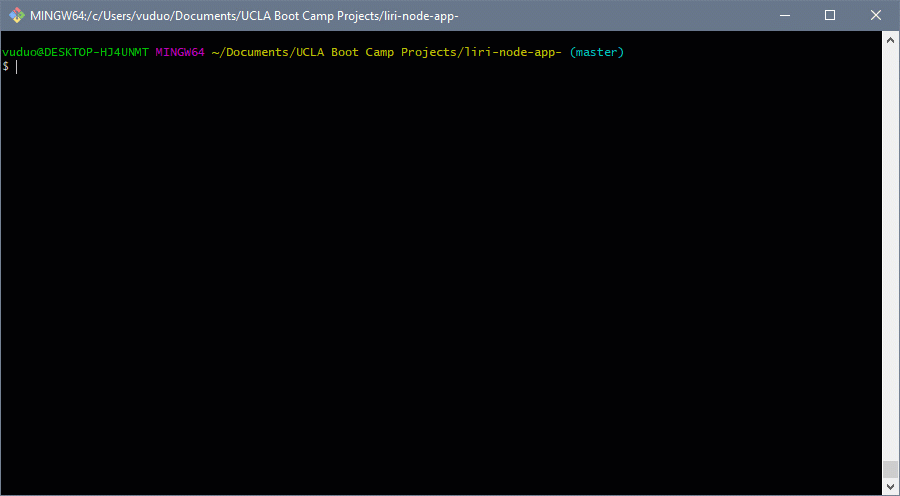

# liri-node-app-
# LIRI Bot

### Overview

This is our first assignment after we studied NodeJS. This app is called LIRI, which takes in parameters from command line and gives you back data.

### Function
liri.js can take in one of the following commands:

* concert-this
* spotify-this-song
* movie-this
* do-what-it-says

1. `node liri.js concert-this <artist/band name here>`

* This will search the Bands in Town Artist Events API (`"https://rest.bandsintown.com/artists/" + artist + "/events?app_id=codingbootcamp"`) for an artist and render the following information about each event to the terminal:

    * Name of the venue
    * Venue location
    * Date of the Event (use moment to format this as "MM/DD/YYYY")

 

2. `node liri.js spotify-this-song '<song name here>'`

* This will show the following information about the song in your terminal/bash window
    ```
    Artist(s)
    The song's name
    A preview link of the song from Spotify
    The album that the song is from
    ```
* If no song is provided then your program will default to "The Sign" by Ace of Base.


3. `node liri.js movie-this '<movie name here>'`

* This will output the following information to your terminal/bash window:

    ```
    Title of the movie.
    Year the movie came out.
    IMDB Rating of the movie.
    Rotten Tomatoes Rating of the movie.
    Country where the movie was produced.
    Language of the movie.
    Plot of the movie.
    Actors in the movie.
    ```

* If the user doesn't type a movie in, the program will output data for the movie 'Mr. Nobody.'
If you haven't watched "Mr. Nobody," then you should: <http://www.imdb.com/title/tt0485947/>
It's on Netflix!


4. `node liri.js do-what-it-says`

* LIRI will take the text inside of random.txt and then use it to call one of LIRI's commands.


### Resources Used

* [Node-Spotify-API](https://www.npmjs.com/package/node-spotify-api)
* [Request](https://www.npmjs.com/package/request)
* [OMDB API](http://www.omdbapi.com)
* [Bands In Town API](http://www.artists.bandsintown.com/bandsintown-api)
* [Moment](https://www.npmjs.com/package/moment)
* [DotEnv](https://www.npmjs.com/package/dotenv)


### Note
* If someone wanted to clone this app from github and run it yourself, you would need to supply your own `.env` file for it to work. This file should have the content below.

```js
# Spotify API keys

SPOTIFY_ID=your-spotify-id
SPOTIFY_SECRET=your-spotify-secret

```

* This file will be used by the `dotenv` package to set what are known as environment variables to the global `process.env` object in node. These are values that are meant to be specific to the computer that node is running on.
